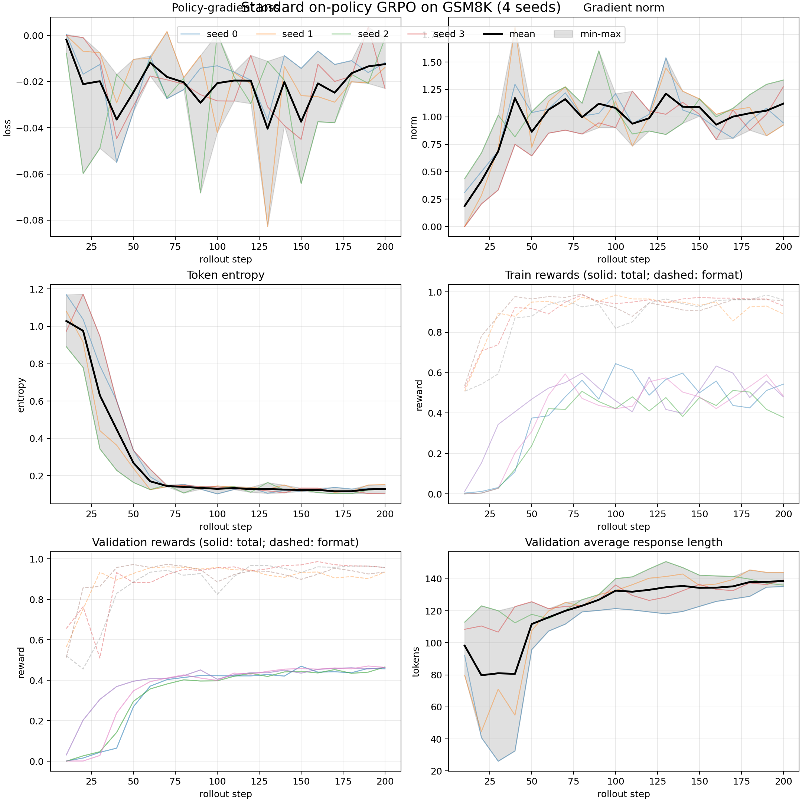

# CS336 作业 5：对齐

## 3.4 Experiments

### Problem: `prompting_baselines` — Run OLMo-2-0425-1B on GSM8K

我使用 `allenai/OLMo-2-0425-1B` 对 GSM8K 测试集中的全部 1,319
道题进行了评测。采样参数为：温度 1.0、top-p 1.0（vLLM 默认值）、
最大生成长度 512 tokens、随机种子 336。对于两种 R1 prompt，模型生成
`</answer>` 后停止，并在输出中保留该停止字符串。

#### （a）评测结果

| Prompt | 格式为 1、答案为 1 | 格式为 1、答案为 0 | 格式为 0、答案为 0 |
|---|---:|---:|---:|
| `question_only` | 7（0.53%） | 406（30.78%） | 906（68.69%） |
| `r1_zero` | 1（0.08%） | 712（53.98%） | 606（45.94%） |
| `r1_zero_three_shot` | 271（20.55%） | 1,004（76.12%） | 44（3.34%） |

每种 prompt 的三个类别之和均为 1,319。三种 prompt 的格式遵循率分别为
31.31%、54.06% 和 96.66%。因此，三样例 R1 prompt 无论是在引导模型
遵循指定格式方面，还是在产生正确答案方面，都明显优于另外两种 prompt。

三个类别的定义是：

1. 类别 1：`format_reward = 1`，`answer_reward = 1`，即格式正确、答案正确；
2. 类别 2：`format_reward = 1`，`answer_reward = 0`，即格式正确、答案错误；
3. 类别 3：`format_reward = 0`，`answer_reward = 0`，即格式错误、答案也被
   grader 判为错误。

为了专门检查 parser 假阴性，我从失败记录中筛选出“响应正文出现标准答案数值”
的疑似解析失败样本，再按数据顺序分别人工核对类别 2 和类别 3 的前 10 条。
我不仅检查数值是否出现，还检查了计算过程以及模型最终表达的答案是否确实正确。

| 类别 | 人工检查数 | 实际答案正确但被 grader 判错 |
|---|---:|---:|
| 类别 2：格式正确、答案奖励为 0 | 10 | 6 |
| 类别 3：格式错误、答案奖励为 0 | 10 | 4 |

类别 2 中实际正确的 6 条，其标准答案分别为 70、23、187、623、3 和 25。
例如，标准答案为 23、187 和 623 的输出都完成了正确计算，并在 `<answer>`
中给出了正确结果，但由于 `<answer>` 内还包含解释文字和单位，answer grader
没有正确识别最终数值。

类别 3 中实际正确的 4 条，其标准答案分别为 24、27、30 和 2,125。例如，
标准答案为 27 的水果题和标准答案为 30 的精灵题都计算正确，但输出缺少严格要求
的标签组合；标准答案为 24 的礼品袋题包含多个损坏或错位的标签；标准答案为
2,125 的积木题给出了正确 `<answer>`，但前面的整体格式不满足 grader 的严格
匹配条件。

这说明两类失败中都确实存在“数学答案正确，但由于解析或格式要求而被判错”的
输出。类别 3 中尤其需要注意：`answer_reward = 0` 并不一定表示 grader 已经
验证了数学答案错误，因为格式检查失败后，grader 会直接返回两个 0。上述样本是
为了发现 parser 假阴性而进行的定向检查，因此 `6/10` 和 `4/10` 不能当作全部
失败输出中的无偏比例估计。

代表性示例如下：

1. **三样例 R1 prompt 的正确回答。** 在标准答案为 18 的鸭蛋问题中，
   模型正确计算出 `16 - 3 - 4 = 9` 个鸡蛋，以及 `9 * 2 = 18` 美元，
   最后输出 `<answer> 18 </answer>`。
2. **零样例 R1 prompt 中格式正确但答案错误的回答。** 在标准答案为 460
   的加班工资问题中，模型正确算出了正常工资为 400 美元、加班时薪为
   12 美元，但只计算了一个小时的加班工资，最终返回
   `<answer> ... $412 ... </answer>`。
3. **`question_only` 中格式和答案均错误的回答。** 在标准答案为 20 杯的
   鸡饲料问题中，模型返回 `The answer is: 65`，不仅答案错误，也没有使用
   `\boxed{}`。
4. **三样例 R1 prompt 中格式正确但答案错误的回答。** 在标准答案为 366
   的下载量问题中，模型错误地把“减少 30%”理解为直接减去 30，最终输出
   `<answer> 430 </answer>`。

#### （b）不同 prompt 对模型行为的影响

仅仅向这个基础模型提供问题，并不足以稳定地引导它进行问答。在
`question_only` 条件下，许多生成结果更像是对网页文本或训练语料的噪声续写：
模型会修改原问题、引入无关故事、重复指令、给出多个互相矛盾的 boxed 数值，
或者完全不输出 boxed 答案。因此，1,319 条输出中有 906 条的格式奖励为 0，
最终只有 7 条获得了正确性奖励。

零样例 `r1_zero` prompt 更容易促使模型尝试显式推理，并使用指定的
`<think>`/`<answer>` 结构。然而，它的推理过程通常不完整，或者存在计算错误。
例如，在加班工资问题中，模型已经识别出 Eliza 工作了 5 个加班小时，却只计算了
1 个小时的加班工资。该 prompt 的格式遵循率高于 `question_only`，但最终只有
1 条回答正确。

三个示例显著约束了模型的输出行为。在 `r1_zero_three_shot` 条件下，模型通常会
先给出一段简短的算术推理，再在规定的标签中输出单个答案；只有 44 条输出的格式
奖励为 0。它还正确解答了 271 道题，远多于另外两种零样例 prompt。不过，大部分
格式正确的回答仍然是错误的。常见原因是模型模仿了示例的表面结构，却使用了错误的
运算，例如把减少 30% 错误地处理为减去 30。总体而言，few-shot prompting
显著提高了模型的行为一致性和 GSM8K 准确率，但仅靠格式指令仍不足以让这个 1B
基础模型稳定地完成数学推理。

## 4.1 Deriving on-policy GRPO

### 4.1.5 Baselines

#### Problem: `baseline_calcs` — Compute the variance of the policy gradient estimator

##### （a）不使用 baseline 时的方差

令单个样本对应的 policy gradient 项为

$$
Z_i=r(A_i)\nabla_\theta\log\pi_\theta(A_i).
$$

由于 $p=\sigma(\theta)$，因此

$$
\frac{\partial p}{\partial \theta} = p(1-p).
$$

下面分别讨论 $A_i=1$ 和 $A_i=0$。

当 $A_i=1$ 时，该动作出现的概率为 $p$，奖励为 $r(1)=1$，且

$$
\begin{aligned}
\nabla_\theta\log\pi_\theta(A_i=1)
&=\nabla_\theta\log p\\
&=\frac{1}{p}p(1-p)\\
&=1-p.
\end{aligned}
$$

因此

$$
Z_i=1-p,\qquad \text{with probability }p.
$$

当 $A_i=0$ 时，该动作出现的概率为 $1-p$，奖励为 $r(0)=0$，且

$$
\begin{aligned}
\nabla_\theta\log\pi_\theta(A_i=0)
&=\nabla_\theta\log(1-p)\\
&=-\frac{1}{1-p}p(1-p)\\
&=-p.
\end{aligned}
$$

由于此时奖励为 0，因此

$$
Z_i=0\cdot(-p)=0,\qquad \text{with probability }1-p.
$$

综上，$Z_i$ 的分布为

$$
Z_i=
\begin{cases}
1-p, & \text{with probability }p,\\
0, & \text{with probability }1-p.
\end{cases}
$$

由此可得

$$
\begin{aligned}
\mathbb E[Z_i]
&=p(1-p)+(1-p)\cdot0\\
&=p(1-p).
\end{aligned}
$$

以及

$$
\begin{aligned}
\mathbb E[Z_i^2]
&=p(1-p)^2+(1-p)\cdot0^2\\
&=p(1-p)^2.
\end{aligned}
$$

所以单个样本项的方差为

$$
\begin{aligned}
\mathrm{Var}(Z_i)
&=\mathbb E[Z_i^2]-\mathbb E[Z_i]^2\\
&=p(1-p)^2-p^2(1-p)^2\\
&=p(1-p)^3.
\end{aligned}
$$

题目中的 estimator 是 $n$ 个独立同分布样本的均值：

$$
\hat g = \frac{1}{n} \sum_{i=1}^n Z_i.
$$

由于各个 $Z_i$ 相互独立，

$$
\begin{aligned}
\mathrm{Var}(\hat g)
&=\mathrm{Var}\left(\frac{1}{n}\sum_{i=1}^n Z_i\right)\\
&=\frac{1}{n}\mathrm{Var}(Z_i).
\end{aligned}
$$

最终得到

$$
\boxed{\mathrm{Var}(\hat g)=\frac{p(1-p)^3}{n}}.
$$

##### （b）使用常数 baseline $b$ 时的方差

加入 baseline $b$ 后，令单个样本对应的 policy gradient 项为

$$
Z_i=(r(A_i)-b)\nabla_\theta\log\pi_\theta(A_i).
$$

当 $A_i=1$ 时，该动作出现的概率为 $p$，并且

$$
r(1)=1,\qquad \nabla_\theta\log\pi_\theta(A_i=1)=1-p.
$$

因此

$$
Z_i=(1-b)(1-p),\qquad \text{with probability }p.
$$

当 $A_i=0$ 时，该动作出现的概率为 $1-p$，并且

$$
r(0)=0,\qquad \nabla_\theta\log\pi_\theta(A_i=0)=-p.
$$

因此

$$
Z_i=(0-b)(-p)=bp,\qquad \text{with probability }1-p.
$$

所以 $Z_i$ 的分布为

$$
Z_i=
\begin{cases}
(1-b)(1-p), & \text{with probability }p,\\
bp, & \text{with probability }1-p.
\end{cases}
$$

首先计算期望：

$$
\begin{aligned}
\mathbb E[Z_i]
&=p(1-b)(1-p)+(1-p)bp\\
&=p(1-p).
\end{aligned}
$$

可见，引入常数 baseline 并没有改变 policy gradient estimator 的期望。
再计算二阶矩：

$$
\mathbb E[Z_i^2]
=p(1-b)^2(1-p)^2+(1-p)b^2p^2.
$$

因此，单个样本项的方差为

$$
\begin{aligned}
\mathrm{Var}(Z_i)
&=\mathbb E[Z_i^2]-\mathbb E[Z_i]^2\\
&=p(1-b)^2(1-p)^2+(1-p)b^2p^2-p^2(1-p)^2\\
&=p(1-p)\left((1-b)^2(1-p)+b^2p-p(1-p)\right)\\
&=p(1-p)(1-p-b)^2.
\end{aligned}
$$

题目中的 estimator 是 $n$ 个独立同分布样本的平均：

$$
\hat g_b = \frac{1}{n} \sum_{i=1}^n Z_i.
$$

所以

$$
\mathrm{Var}(\hat g_b)=\frac{1}{n}\mathrm{Var}(Z_i).
$$

最终得到

$$
\boxed{
\mathrm{Var}(\hat g_b)
=\frac{p(1-p)(1-p-b)^2}{n}
}.
$$

##### （c）使用 population mean baseline 时的方差

由于奖励函数为 $r(A)=\mathbf 1\{A=1\}$，因此奖励的总体均值为

$$
b=\mathbb E[r(A)]
=1\cdot p+0\cdot(1-p)
=p.
$$

将 $b=p$ 代入第（b）问的结果：

$$
\begin{aligned}
\mathrm{Var}(\hat g_p)
&=\frac{p(1-p)(1-p-b)^2}{n}\\
&=\frac{p(1-p)(1-2p)^2}{n}.
\end{aligned}
$$

不使用 baseline 时，第（a）问得到

$$
\mathrm{Var}(\hat g)
=\frac{p(1-p)^3}{n}.
$$

为了判断 population mean baseline 是否减小方差，比较二者之差：

$$
\begin{aligned}
\mathrm{Var}(\hat g_p)-\mathrm{Var}(\hat g)
&=\frac{p(1-p)}{n}
\left((1-2p)^2-(1-p)^2\right)\\
&=\frac{p(1-p)}{n}
\left(1-4p+4p^2-1+2p-p^2\right)\\
&=\frac{p^2(1-p)(3p-2)}{n}.
\end{aligned}
$$

当 0 < p < 1 时，p²(1−p)/n > 0，所以方差之差的符号只由
3p−2 决定。因此：

- 当 0 < p < ⅔ 时，3p−2 < 0，population mean baseline
  会降低方差；
- 当 p = ⅔ 时，两种 estimator 的方差相等；
- 当 ⅔ < p < 1 时，3p−2 > 0，population mean baseline
  反而会增大方差。

特别地，当 p = ½ 时，

$$
\mathrm{Var}(\hat g_p)
=\frac{p(1-p)(1-2p)^2}{n}
=0.
$$

这是因为第（b）问的最优常数 baseline 是 b* = 1−p；只有在
p = ½ 时，population mean baseline b = p 恰好等于该最优值。

## 4.2 Implementing on-policy GRPO

### 4.2.1 Using Hugging Face models

#### Problem: `tokenize_prompt_and_output` — Prompt and output tokenization

实现见
[`tests/adapters.py` 中的 `run_tokenize_prompt_and_output`](tests/adapters.py)。

该函数首先使用同一个 tokenizer 分别编码 prompt 和 output，并设置
`add_special_tokens=False`。分别编码很重要：如果先拼接原始字符串再
tokenize，分词器可能在 prompt/output 边界处合并 token，而且无法可靠地确定
哪些 token 属于 response。

对于每个样本，函数将两部分 token ID 拼接为

```text
[prompt tokens, response tokens]
```

并构造与完整序列对齐的 mask：

```text
[0, ..., 0, 1, ..., 1]
```

其中 prompt token 对应 0，response token 对应 1。batch 中的序列在右侧使用
`tokenizer.pad_token_id` 补齐到相同长度，padding 对应的 mask 也设为 0。

为了构造 causal language modeling 输入，完整序列随后错开一位：

```python
input_ids = tokens[:, :-1]
labels = tokens[:, 1:]
response_mask = masks[:, 1:]
```

假设未移动的序列和 mask 为

```text
tokens = [P1, P2, P3, R1, R2, R3]
mask   = [ 0,  0,  0,  1,  1,  1]
```

则返回结果为

```text
input_ids    = [P1, P2, P3, R1, R2]
labels       = [P2, P3, R1, R2, R3]
response_mask= [ 0,  0,  1,  1,  1]
```

这里 `response_mask` 使用 `masks[:, 1:]`，因为它必须与 `labels` 对齐：
输入位置 P3 预测的 label 是第一个 response token R1，所以该位置的 mask
应该为 1。

最终三个 tensor 的形状均为

```text
(batch_size, max(prompt_and_output_lens) - 1)
```

其中 `input_ids` 和 `labels` 的 dtype 为 `torch.long`，`response_mask`
的 dtype 为 `torch.bool`。实现通过以下测试：

```bash
uv run pytest -k test_tokenize_prompt_and_output
```

#### Problem: `get_response_log_probs` — Response log-probs (and entropy)

实现见
[`tests/adapters.py` 中的 `run_get_response_log_probs`](tests/adapters.py)。

模型前向传播返回的 logits 形状为

```text
(batch_size, sequence_length, vocab_size)
```

先在词表维度上应用 `log_softmax`：

```python
all_log_probs = torch.log_softmax(logits, dim=-1)
```

这会得到每个位置对词表中所有 token 的条件 log-probability。题目只需要实际
label token 的 log-probability，因此使用 `torch.gather` 在最后一维按照
`labels` 取值：

```python
log_probs = torch.gather(
    all_log_probs,
    dim=-1,
    index=labels.unsqueeze(-1),
).squeeze(-1)
```

`labels.unsqueeze(-1)` 将 labels 的形状从
`(batch_size, sequence_length)` 变为
`(batch_size, sequence_length, 1)`，使其可以在词表维度上作为索引。
取值并移除最后一个大小为 1 的维度后，
`log_probs` 的形状为 `(batch_size, sequence_length)`。令
$\ell_{b,t}$ 表示 `log_probs[b, t]`，$y_{b,t}$ 表示该位置的 label token，则

$$
\ell_{b,t}
=\log p_\theta\!\left(y_{b,t}\mid x_{b,1:t-1}\right).
$$

如果 `return_token_entropy=True`，还要计算每个位置上整个词表分布的 entropy：

$$
H_{b,t}
=-\sum_{v\in\mathcal V}
p_\theta\!\left(v\mid x_{b,1:t-1}\right)
\log p_\theta\!\left(v\mid x_{b,1:t-1}\right).
$$

对应实现为：

```python
all_probs = torch.softmax(logits, dim=-1)
token_entropy = -(all_probs * all_log_probs).sum(dim=-1)
```

这里 `log_probs` 只衡量模型分配给实际 label token 的概率，而
`token_entropy` 衡量模型在整个词表上的不确定程度。当
`return_token_entropy=False` 时，返回的字典应只包含 `"log_probs"`；
为 True 时再加入 `"token_entropy"`。

实现通过以下测试：

```bash
uv run pytest -k test_get_response_log_probs
```

### 4.2.3 GRPO components

#### Problem: `compute_rollout_rewards` — Computing the rewards of rollouts

实现见
[`tests/adapters.py` 中的 `run_compute_rollout_rewards`](tests/adapters.py)。

对于 rollout batch 中的每个 response，函数将它与对应的 ground truth 一起
传给 `reward_fn`：

```python
reward_dicts = [
    reward_fn(response, ground_truth)
    for response, ground_truth in zip(
        rollout_responses,
        repeated_ground_truths,
    )
]
```

每次调用会返回包含总奖励和各奖励分量的字典，例如：

```python
{
    "reward": 1.0,
    "format_reward": 1.0,
    "answer_reward": 1.0,
}
```

训练时需要对所有 rollout 的总 reward 进行 reshape、求组均值和标准差等 tensor
运算，因此提取每个字典中的 `"reward"`，构造一维浮点 tensor：

```python
raw_rewards = torch.tensor(
    [reward["reward"] for reward in reward_dicts],
    dtype=torch.float32,
)
```

它的形状为

```text
(rollout_batch_size,)
```

其中

```text
rollout_batch_size
= n_prompts_per_rollout_batch * group_size
```

也就是说，一个 rollout batch 包含多个 prompt，每个 prompt 生成
`group_size` 个 response。扁平的 `raw_rewards` 可以在下一步 reshape 为

```text
(n_prompts_per_rollout_batch, group_size)
```

从而在每个 prompt 的组内计算 advantage。

其他 reward 分量用于记录训练状态，因此按整个 rollout batch 求均值并放入
metadata：

```python
metadata = {
    "mean_reward": (
        sum(item["reward"] for item in reward_dicts)
        / len(reward_dicts)
    ),
    "mean_format_reward": (
        sum(item["format_reward"] for item in reward_dicts)
        / len(reward_dicts)
    ),
    "mean_answer_reward": (
        sum(item["answer_reward"] for item in reward_dicts)
        / len(reward_dicts)
    ),
}
```

`raw_rewards` 保留每个 response 的训练信号，metadata 则只保存整个 batch 的
汇总统计。实现通过以下测试：

```bash
uv run pytest -k test_compute_rollout_rewards
```

#### Problem: `compute_group_normalized_rewards_grpo` — Group normalization

实现见
[`tests/adapters.py` 中的 `run_compute_group_normalized_rewards`](tests/adapters.py)。

输入的 `raw_rewards` 是长度为 `rollout_batch_size` 的一维 tensor。由于同一个
prompt 的 `group_size` 个 response 连续排列，首先将其恢复成分组形式：

```python
grouped_rewards = raw_rewards.reshape(-1, group_size)
```

其形状为

```text
(n_prompts_per_rollout_batch, group_size)
```

接着沿每一行计算同一个 prompt 内的 reward 均值和标准差：

```python
group_means = grouped_rewards.mean(dim=-1, keepdim=True)
group_stds = grouped_rewards.std(dim=-1, keepdim=True)
```

`keepdim=True` 使二者的形状保持为
`(n_prompts_per_rollout_batch, 1)`，因此 PyTorch 可以将它们广播到每个
group 的所有 response 上。GRPO advantage 为

$$
A_{i,j}=\frac{r_{i,j}-\mu_i}{\sigma_i+\epsilon}.
$$

其中

$$
\mu_i=\frac{1}{G}\sum_{j=1}^{G}r_{i,j},
$$

而实现按照题目要求直接使用默认的 `torch.std`。因此标准差使用
Bessel correction，即

$$
\sigma_i=\sqrt{\frac{1}{G-1}\sum_{j=1}^{G}(r_{i,j}-\mu_i)^2}.
$$

分母加入 `advantage_eps`，可以避免某一组所有 reward 相同时发生除零：

```python
advantages = (
    grouped_rewards - group_means
) / (group_stds + advantage_eps)
```

计算完成后，将 advantages 展平回与输入相同的形状：

```python
advantages = advantages.reshape(rollout_batch_size)
```

例如，当

```python
raw_rewards = torch.tensor([1.0, 0.0, 0.0, 1.0])
group_size = 2
```

分组后的 reward 为

```text
[[1, 0],
 [0, 1]]
```

每组均值均为 0.5，默认样本标准差均为

$$
\sqrt{\frac{(1-0.5)^2+(0-0.5)^2}{2-1}}=\sqrt{0.5}.
$$

因此输出约为

```text
[0.70710576, -0.70710576, -0.70710576, 0.70710576]
```

函数还返回 reward 和 advantage 的汇总统计作为 metadata。实现通过以下测试：

```bash
uv run pytest -k test_compute_group_normalized_rewards_grpo
```

## 4.3 Experiments

### Problem: `grpo_experiments_standard_on_policy` — Standard on-policy GRPO on GSM8K

#### （a）训练脚本和实验设置

完整训练入口为 [`scripts/grpo_train.py`](scripts/grpo_train.py)，四个随机种子的启动
脚本为 [`scripts/run-4-seeds.sh`](scripts/run-4-seeds.sh)。训练脚本接收模型、prompt、
训练/验证数据路径、采样参数和训练参数；初始化 OLMo-2-0425-1B、AdamW、vLLM server、
GSM8K 数据和 W&B 后，每一步依次同步权重、执行 on-policy rollout、计算组内归一化
advantage、更新 policy，并定期验证和记录 rollout。

实验使用题目建议的超参数：200 个 rollout steps、学习率 $10^{-5}$、256 responses/batch、
每个 prompt 生成 8 个 responses、32 次 gradient accumulation、temperature 1.0、最多
512 tokens、最大 gradient norm 1.0。每 10 steps 在 1,024 个 GSM8K validation
examples 上评测一次，每 40 steps 保存一次 rollout。四个完整 run 使用 seed 0、1、2、3；
W&B 中早期只运行 50 steps 的旧 seed-0 run 不计入最终统计。原始交互式曲线和 rollout
tables 见 [W&B workspace](https://wandb.ai/jerry520/cs336-assignment5-grpo/workspace?nw=nwuserjerry520)。

#### （b）50-step sanity check

前 50 steps 已经给出了清晰的正确性证据。四个 seed 的 validation reward 从 step 10
的 0.0000--0.0313 上升到 step 50 的 0.2695、0.2959、0.3955、0.3477；同时 validation
format reward 从 0.5127--0.6563 上升到 0.8828--0.9727。也就是说，提升同时出现在
答案正确性和格式遵循上，而不是只由某一个 batch 的偶然 reward 造成。训练没有出现
NaN、无限 gradient norm 或 reward 崩溃，因此我继续运行了完整的 200 steps。

#### （c）四个随机种子的完整结果

下图由 W&B public histories 生成。每条浅色实线代表一个 seed；loss、gradient norm、
entropy 和 response length 面板中的黑线是四个 seed 的均值，灰色区域是逐 step 的
min--max 区间。reward 面板的实线为 total reward，虚线为 format reward。



各指标的变化如下：

- Policy-gradient loss 在 0 附近呈有噪声的负值（大多约为 $-0.01$ 到 $-0.04$），
  没有持续增大或发散。该 surrogate loss 本身不要求单调下降。
- Gradient norm 从接近 0 上升后主要在约 0.8--1.3 附近波动，偶尔出现约 1.8 的峰值，
  但没有持续增长；训练使用 `max_grad_norm=1.0` 进行 clipping。
- Token entropy 从约 0.9--1.2 快速下降，在约 step 60 后稳定在 0.10--0.16，说明 policy
  随着训练变得更确定。四个 seed 的下降轨迹相似。
- Train total reward 从接近 0 提升到约 0.4--0.6，但因为它只基于当前 rollout batch，
  step 间波动明显。Train format reward 很快达到约 0.9--0.98。
- Validation total reward 的趋势比 train reward 平滑：约 step 60 后达到 0.36--0.41，
  随后缓慢提升，并在 step 200 收敛到 0.4570--0.4658。Validation format reward
  最终为 0.9355--0.9580。
- Validation average response length 在训练前期的 seed 间差异较大，但后期收敛到
  135--144 tokens。长度没有无界增长，因此 reward 提升不像是由不断延长回答造成的。

最终验证结果为：

| Seed | Final val reward / accuracy | Final val format reward | Final average response length |
|---:|---:|---:|---:|
| 0 | 0.4570 | 0.9355 | 135.14 |
| 1 | 0.4658 | 0.9580 | 144.01 |
| 2 | 0.4629 | 0.9355 | 136.10 |
| 3 | 0.4639 | 0.9580 | 139.22 |
| **Mean** | **0.4624** | **0.9468** | **138.62** |

四个 seed 的最终 validation accuracy 均值为 46.24%，样本标准差为 0.38 个百分点，
范围为 45.70%--46.58%（最大差距 0.88 个百分点）。因此本实验不仅明显超过题目要求的
25% 平均准确率，而且最终结果的 seed 方差很小。需要注意的是，早期“开始学习”的时间
存在更明显的 seed 差异；例如 step 50 的 validation reward 范围仍有 0.2695--0.3955。

#### 训练前后的 rollout 示例

训练前的 `r1_zero` baseline 经常遵循标签格式，但算术推理错误。例如：

1. 对于“16 个蛋，吃 3 个、烘焙用 4 个，剩余每个卖 2 美元”，模型错误地把问题扩展成
   每日 144 个蛋并输出 `<answer>... $288 ...</answer>`，而正确答案是 18。
2. 对于“蓝色布料 2 bolts，白色为其一半，总共多少”，模型错误地计算为
   `<answer>... totals 1 bolt ...</answer>`，而正确答案是 3。

step 200 的实际 rollout 已能稳定完成多步算术并给出简洁的标签化答案。例如：

1. 对于“5 包金枪鱼每包 2 美元、4 瓶水每瓶 1.5 美元、总共支付 56 美元，其他商品花费
   多少”，模型计算 $5\times2=10$、$4\times1.5=6$、$56-(10+6)=40$，并输出
   `<answer> 40 </answer>`，与 ground truth 一致。
2. 对于“第一周每天训练 2 小时，第二周每天训练 3 小时，两周共多少小时”，模型计算
   $2\times7=14$、$3\times7=21$、$14+21=35$，并输出
   `<answer> 35 </answer>`，与 ground truth 一致。

这些例子与定量结果一致：训练后模型不只是更经常生成合法的 `<think>`/`<answer>`
结构，也更经常完成正确的中间运算并把最终数值单独放入 answer 标签中。

## 5 RL algorithm variants

### 5.1 Dr. GRPO

#### Problem: `think_about_length_normalization` — Think about length normalization

两种方法的核心区别是：**按序列长度归一化让每条回答的总权重近似相同；使用固定
常数归一化让每个 token 的权重近似相同。**

| 方法 | 优点 | 缺点 | 更适合的场景 |
|---|---|---|---|
| 除以每条回答自己的长度 | 长、短回答对 loss 的总贡献接近，不会让长回答仅因 token 更多就主导训练 | 短回答中每个 token 的权重更大，可能偏好短回答并低估必要的长推理 | 回答长度差异很大，而且希望每条回答同等重要，例如开放式对话 |
| 所有回答除以同一个固定常数 | 不会根据模型采样出的回答长度重新加权，可以保留长推理中每个生成决策的贡献 | 长回答包含更多 token，因此总梯度更大；冗长或重复回答可能主导训练并增加方差 | 长度已由 `max_tokens` 或停止标记控制、且长推理过程有价值的任务，例如 GSM8K |

例如，两条 advantage 相同的回答分别包含 20 和 100 个 token。按各自长度归一化时，
两条回答的总权重近似相同；使用固定常数时，100-token 回答的总贡献大约是 20-token
回答的 5 倍。因此，没有一种方法在所有场景下都最好：希望“每条回答权重相同”时使用
sequence normalization；希望避免隐式偏好短回答、保留长推理贡献时使用固定常数。

#### Problem: `compute_group_normalized_rewards_drgrpo` — Dr. GRPO Group normalization

具体代码见
[`tests/adapters.py` 中的 `run_compute_group_normalized_rewards`](tests/adapters.py)。
该实现现在支持 `baseline="mean"` 和 `baseline="none"`，以及
`advantage_normalizer="std"` 和 `advantage_normalizer="none"`。

- `baseline="mean"` 时，对每个 prompt 的 group 减去组内平均 reward；
- `baseline="none"` 时，直接保留原始 reward，不减 baseline；
- `advantage_normalizer="std"` 时，将结果除以组内标准差加
  `advantage_eps`；
- `advantage_normalizer="none"` 时，不再进行尺度归一化。

因此，Dr. GRPO 使用的组合
`baseline="mean", advantage_normalizer="none"` 对应

$$
A_{i,j}=r_{i,j}-\bar r_i,
$$

而不是标准 GRPO 的

$$
A_{i,j}=\frac{r_{i,j}-\bar r_i}{s_i+\epsilon}.
$$

实现通过以下测试：

```bash
uv run pytest -k compute_group_normalized_rewards_drgrpo
```

#### Problem: `aggregate_loss_across_microbatch_constant` — Dr. GRPO loss aggregation

具体代码见
[`tests/adapters.py` 中的 `run_aggregate_loss_across_microbatch`](tests/adapters.py)。
当 `loss_normalization="constant"` 时，函数先使用 response mask 排除 prompt、padding
等不属于 response 的 token，然后将所有有效 token 的 policy-gradient loss 求和，最后
除以固定的 `normalization_constant`：

$$
L=\frac{1}{C}\sum_{i,t}m_{i,t}\ell_{i,t},
$$

其中 $m_{i,t}$ 是 response mask，$C$ 是整个训练过程中保持不变的归一化常数。
这与 sequence normalization 不同：后者先除以每条 response 自己的有效 token 数，再
对 batch 中的 sequence 求平均；constant normalization 不会根据本批次生成长度改变
每个 token 的权重。

实现通过以下测试：

```bash
uv run pytest -k test_aggregate_loss_across_microbatch_constant
```

#### Problem: `think_about_rft` — Think about RFT

**更新方式对比**

| 情况 | RFT | Dr. GRPO |
|---|---|---|
| 单个正确回答 | 提高其概率 | 获得正 advantage，提高其概率 |
| 单个错误回答 | 不参与更新 | 获得负 advantage，降低其概率 |
| 一组回答全错 | 不更新 | 不更新 |
| 一组回答全对 | 继续学习正确回答 | advantage 全为 0，不更新 |

- RFT 只学习 reward 为 1 的回答，可以看成对正确 rollouts 做 filtered SFT。
- Dr. GRPO 使用 $r-\bar r$，学习的是同一道题不同回答之间的相对好坏。

**期望**

固定 prompt $x$，记单个 rollout 的期望 policy gradient 为

$$
g_x=\mathbb E\left[r(Y\mid x)\nabla_\theta\log\pi_\theta(Y\mid x)\mid x\right].
$$

那么 $G$ 个 rollouts 的 RFT 和 Dr. GRPO 梯度期望分别为

$$
\mathbb E[\hat g_{\mathrm{RFT}}\mid x]=\frac{G}{Z}g_x.
$$

$$
\mathbb E[\hat g_{\mathrm{Dr}}\mid x]=\frac{G-1}{Z}g_x.
$$

所以二者的期望方向相同，但 Dr. GRPO 因为使用了包含当前样本的 group mean，大小比
RFT 少一个 $1-1/G$ 的固定系数。这个系数可以由学习率或归一化常数吸收。

**方差**

- Dr. GRPO 减去组内平均 reward，去除了同一 prompt 下的公共 reward 水平，通常具有
  更低的梯度方差。
- 例如一组回答全对时，RFT 仍会产生依赖具体采样回答的随机梯度，而 Dr. GRPO 的梯度
  为 0，因此消除了这部分噪声。
- 不过 group mean 本身也是随机估计量，所以小 group 下不能保证方差一定更低。

**适用场景**

| 场景 | 更适合的方法 | 原因或限制 |
|---|---|---|
| 成功样本可靠，希望保存并重复训练 | RFT | 可过滤出正确 rollouts，作为离线 SFT 数据复用 |
| 同一道题经常生成有对有错的回答 | Dr. GRPO | 可同时提高正确回答、降低错误回答的概率 |
| 不同 prompt 的难度差异较大 | Dr. GRPO | 每个 prompt 内单独减均值，减少容易题成功样本对训练的主导 |
| 只能为每个 prompt 生成一个回答 | RFT | RFT 可使用 $G=1$；Dr. GRPO 在 $G=1$ 时 advantage 恒为 0 |
| 困难 prompt 的整组回答全部错误 | 两者都不合适 | 两者都没有梯度，需要增大 $G$、改善探索或使用更密集的 reward |

**计算成本。** 题目中的两种方法都生成 $G$ 个 responses，因此使用相同 $G$ 时，
rollout generation 成本基本相同。RFT 可以过滤并离线复用正确回答；Dr. GRPO 通常
需要用当前 policy 反复生成新的 on-policy rollouts。

#### Problem: `derive_difficulty_reweightings` — Difficulty reweightings

定义当前 policy 在 prompt $x$ 上的成功概率

$$
p_\theta(x)=\mathbb E_{y\sim\pi_\theta(\cdot\mid x)}[r(y\mid x)].
$$

因为 reward 是二元变量，所以当 $G\to\infty$ 时，组内均值和标准差分别收敛到

$$
\mu\to p_\theta(x),\qquad \operatorname{std}\to\sqrt{p_\theta(x)(1-p_\theta(x))}.
$$

另外，score-function identity 给出

$$
\mathbb E_y[\nabla_\theta\log\pi_\theta(y\mid x)]=0.
$$

因此

$$
\mathbb E_y[(r-p_\theta(x))\nabla_\theta\log\pi_\theta(y\mid x)]=\nabla_\theta p_\theta(x).
$$

下面将各算法的极限期望梯度与
$w(x,\operatorname{stopgrad}(\pi_\theta))\nabla_\theta p_\theta(x)$ 对照；计算梯度时
只使用 $w$ 的当前数值，不对 $w$ 本身反向传播。

##### （a）Dr. GRPO

设置 $Z=G$ 后，rollout 求和是样本平均。令 $G\to\infty$，其条件期望梯度为

$$
\mathbb E_y[(r-p_\theta(x))\nabla_\theta\log\pi_\theta(y\mid x)]=\nabla_\theta p_\theta(x).
$$

因此

$$
\boxed{w_{\mathrm{Dr.GRPO}}(x)=1}.
$$

Dr. GRPO 在该极限下不给 prompts 施加额外的难度权重，而是优化原始的平均成功率。
有限 $G$ 时，包含当前样本的 group mean 会产生 $1-1/G$ 的整体缩放；题目取
$G\to\infty$ 后该缩放消失。

##### （b）标准 GRPO

标准 GRPO 还将 advantage 除以 reward 的组内标准差。在无限 group 极限下，标准差只
依赖 prompt $x$，并在当前梯度步骤中视为常数，所以

$$
\mathbb E_y\left[\frac{r-p_\theta(x)}{\sqrt{p_\theta(x)(1-p_\theta(x))}}\nabla_\theta\log\pi_\theta(y\mid x)\right]=\frac{\nabla_\theta p_\theta(x)}{\sqrt{p_\theta(x)(1-p_\theta(x))}}.
$$

因此

$$
\boxed{w_{\mathrm{GRPO}}(x)=\frac{1}{\sqrt{p_\theta(x)(1-p_\theta(x))}}}.
$$

该权重在 $p_\theta(x)=0.5$ 附近最小，并在正确率接近 0 或 1 时增大；因此它相对于
中等难度 prompts，会提高极难和极易 prompts 的形式权重。实际实现需要在分母加入
$\epsilon$，避免 $p_\theta(x)=0$ 或 1 时除零。

##### （c）MaxRL

MaxRL 将 centered reward 除以组内平均 reward。当 $G\to\infty$ 时，
$\mu\to p_\theta(x)$，因此

$$
\mathbb E_y\left[\frac{r-p_\theta(x)}{p_\theta(x)}\nabla_\theta\log\pi_\theta(y\mid x)\right]=\frac{\nabla_\theta p_\theta(x)}{p_\theta(x)}.
$$

所以

$$
\boxed{w_{\mathrm{MaxRL}}(x)=\frac{1}{p_\theta(x)}}.
$$

prompt 的成功概率越低，权重越大，因此 MaxRL 明确地将更多更新权重放在困难 prompts
上。与标准 GRPO 相同，实际实现需要用 $\epsilon$ 或其他裁剪方式处理
$p_\theta(x)\approx0$ 的情况。

| 方法 | 难度重加权 $w(x)$ | 对 prompts 的影响 |
|---|---:|---|
| Dr. GRPO | $1$ | 不额外按照当前难度重加权 |
| 标准 GRPO | $1/\sqrt{p_\theta(x)(1-p_\theta(x))}$ | 相对提高正确率接近 0 或 1 的 prompts 权重 |
| MaxRL | $1/p_\theta(x)$ | 成功率越低、难度越高，权重越大 |

#### Problem: `think_about_advantage_normalization` — Advantage normalization

令 $p=p_\theta(x)$ 表示当前 policy 在 prompt $x$ 上的正确率。对于二元 reward，
三种方法在 $G\to\infty$ 时分别对应以下难度权重：

| Advantage | 隐式权重 $w(x)$ | 优点 | 缺点与风险 | 更适合的场景 |
|---|---:|---|---|---|
| 不做归一化：$r-\mu$ | $1$ | 不额外改变 prompt 难度分布；直接优化平均正确率；数值相对稳定 | 不会特别关注困难题；不同 prompt 的 advantage 尺度可能差异较大 | 希望忠实优化原始 prompt 分布，或 group 较小、归一化统计量不可靠时 |
| 除以 group std | $1/\sqrt{p(1-p)}$ | 统一不同 group 的 advantage 尺度，可减少某些 group 仅因尺度较大而主导更新 | 当 std 很小时会放大估计噪声；隐式提高极难和极易题的形式权重；必须加入 $\epsilon$ | group 足够大、std 估计可靠，并希望平衡不同 group 的更新尺度时 |
| 除以 group mean | $1/p$ | 明确提高困难 prompt 的相对权重，鼓励提升低成功率题目 | $p$ 很小时权重和方差可能很大；会偏离原始平均正确率目标；必须加入 $\epsilon$ 或裁剪 | 困难题仍有一定成功样本、且训练目标希望重点改善困难题时 |

例如，假设三道题的当前正确率分别为 $p=0.01,0.5,0.99$，对应的隐式权重大约为：

| 正确率 $p$ | 不归一化 | 除以 std | 除以 mean |
|---:|---:|---:|---:|
| $0.01$ | $1$ | $10.05$ | $100$ |
| $0.50$ | $1$ | $2$ | $2$ |
| $0.99$ | $1$ | $10.05$ | $1.01$ |

因此，不归一化不会显式改变 prompt 权重；std normalization 相对于中等难度题，
形式上同时放大极难和极易题；mean normalization 则强烈偏向当前成功率低的困难题。
不过，权重只是乘在 $\nabla_\theta p_\theta(x)$ 前面的系数，不代表最终梯度必然更大。
特别是当一组 responses 全对或全错时，centered advantages 均为 0，三种方法都不会从
该 group 获得更新；对 std 或 mean 做除法时还必须使用 $\epsilon$ 防止除零。

#### Problem: `compute_group_normalized_rewards_maxrl` — MaxRL Group normalization

具体代码见
[`tests/adapters.py` 中的 `run_compute_group_normalized_rewards`](tests/adapters.py)。
实现先把 rewards reshape 为 `(n_prompts, group_size)`，使每一行对应同一个 prompt 的
responses。对于 MaxRL 使用的
`baseline="mean", advantage_normalizer="mean"`，先计算每组的平均 reward
$\bar r_i$，再得到

$$
A_{i,j}=\frac{r_{i,j}-\bar r_i}{\bar r_i+\epsilon}.
$$

其中，分子减去 group mean 形成 centered advantage，分母中的
`advantage_eps` 避免整组 reward 均为 0 时除零。计算完成后，再将 advantages reshape
回与输入相同的一维形状。该实现同时保留了 `"std"` 和 `"none"` normalizers 的行为。

实现通过题目指定的测试：

```bash
uv run pytest -k compute_group_normalized_rewards_maxrl
```

测试结果为 `1 passed, 25 deselected`；进一步同时运行 GRPO、Dr. GRPO 和 MaxRL 的三项
group-normalization 测试，结果为 `3 passed, 23 deselected`。

#### Problem: `grpo_train_step_variants_on_policy` — GRPO train step variants

具体代码见 [`tests/adapters.py` 中的 `run_grpo_train_step`](tests/adapters.py)。该实现将
`baseline`、`advantage_normalizer` 和 `loss_normalization` 传给底层计算函数，因此支持
以下 on-policy variants：

| Variant | `baseline` | `advantage_normalizer` |
|---|---|---|
| 标准 GRPO | `"mean"` | `"std"` |
| Dr. GRPO | `"mean"` | `"none"` |
| RFT | `"none"` | `"none"` |
| MaxRL | `"mean"` | `"mean"` |

四种方法均支持 `loss_normalization="sequence"` 和 `"constant"`，并保持
`importance_reweighting_method="none"`，即本题要求的 on-policy 设置。

**Zero-advantage filtering。** 函数先在完整 rollout batch 上计算 group statistics 和
advantages，再在每个 microbatch 内构造 `micro_nonzero_mask`。假设原 microbatch 大小
为 $M$、过滤后保留 $K$ 条 sequence、padding 后长度为 $T$，则张量 shape 从
`(M, T)` 变为 `(K, T)`，advantages 从 `(M,)` 变为 `(K,)`。只有过滤后的
`input_ids`、`labels` 和 `response_mask` 会进入模型，因此 advantage 为 0 的错误 RFT
样本不会消耗模型 forward 和 backward。若整个 microbatch 都为 0，则直接跳过；若整个
rollout batch 都为 0，则安全返回 zero loss 和 zero gradient。

过滤后仍保持原始 loss 的归一化：对于 sequence normalization，microbatch loss 是
$K$ 条保留 sequence 的平均，因此乘以 $K/B$，其中 $B$ 是过滤前的
`rollout_batch_size`；对于 constant normalization，每个 microbatch 已经将 token loss
之和除以同一个固定常数 $Z$，所以不同 microbatches 的梯度直接累加，不再乘 batch-size
比例：

$$
L_b^{\mathrm{sequence}}=\frac{K}{B}L_{b,\mathrm{filtered}},\qquad L_b^{\mathrm{constant}}=\frac{1}{Z}\sum_{i\in b,t}\ell_{i,t}.
$$

实现通过题目指定的测试：

```bash
uv run pytest -k test_grpo_train_step_variants_on_policy
```

四个 variants 均通过；连同标准 on-policy、group normalization 和 loss aggregation
回归测试共 `10 passed, 16 deselected`。另外，全零 advantage batch 的边界测试返回
`loss=0`、`gradient_norm=0` 和 `token_entropy=0`。

### 5.4 Experiments

#### Problem: `grpo_experiments_variants_on_policy` — Compare on-policy RL algorithms

我使用与标准 GRPO 实验相同的模型、`r1_zero` prompt、数据、学习率
$10^{-5}$、rollout batch size 256、group size 8、200 个 rollout steps 和验证设置。
每种方法均运行 seed 0、1、2、3。除标准 GRPO 使用 sequence normalization 外，四个
新变体均使用题目规定的 constant normalization。原始运行记录见
[W&B workspace](https://wandb.ai/jerry520/cs336-assignment5-grpo/workspace?nw=nwuserjerry520)。

下图左侧画出了每个 seed 的 validation reward（浅色线）、四 seed 均值（粗实线）和
逐 step 的 min--max 范围（阴影）；右侧显示最终 validation reward 的四个 seed、均值
以及样本标准差。


最终结果如下。括号中的标准差均为四个 seed 之间的样本标准差。

| Method | Seed 0 | Seed 1 | Seed 2 | Seed 3 | Mean | Sample SD |
|---|---:|---:|---:|---:|---:|---:|
| Standard GRPO | 0.4570 | 0.4658 | 0.4629 | 0.4639 | **0.4624** | **0.0038** |
| GRPO_constant | 0.0850 | 0.4434 | 0.4717 | 0.4395 | 0.3599 | 0.1838 |
| Dr_GRPO | 0.0908 | 0.0869 | 0.4814 | 0.4541 | 0.2783 | 0.2191 |
| RFT | 0.3721 | 0.0713 | 0.4092 | 0.3818 | 0.3086 | 0.1590 |
| MaxRL | 0.4326 | 0.4258 | 0.4473 | 0.4297 | **0.4338** | **0.0094** |

**平均性能。** 在本次固定超参数比较中，standard GRPO 的平均 final validation reward
最高，为 0.4624。MaxRL 以 0.4338 排在第二，也是四个新变体中表现最好的方法，比
standard GRPO 低约 2.86 个百分点。GRPO_constant、RFT 和 Dr_GRPO 的平均值依次为
0.3599、0.3086 和 0.2783，但这些均值受到少数失败 seed 的明显影响。

**方差和训练稳定性。** Standard GRPO 的样本标准差只有 0.0038，是所有方法中最稳定
的；四个 seed 的最终结果都集中在 0.4570--0.4658。新变体中 MaxRL 的方差最低，样本
标准差为 0.0094，四个 seed 都成功学习。相比之下，GRPO_constant 有 1 个失败 seed，
Dr_GRPO 有 2 个失败 seed，RFT 有 1 个失败 seed，因此样本标准差分别达到 0.1838、
0.2191 和 0.1590。

**短输出坍缩。** 失败并不是简单的格式学习失败。W&B 中这些 run 的最终 format reward
仍然很高，但平均 response length 坍缩到了很短的范围：GRPO_constant seed 0 为
15.25 tokens，Dr_GRPO seed 0/1 分别为 22.53 和 13.41 tokens，RFT seed 1 为
13.31 tokens。模型往往输出类似
`90 </think> <answer> 80 </answer>` 的极短响应：格式合法，但 `<think>` 中几乎没有
推理，最终 reward 仅约 0.07--0.09。与之相对，正常 runs 最终平均 response length
通常约为 120--156 tokens。

每 40 steps 保存的 rollout 证实了这一现象，但 validation history 表明坍缩实际发生在
第一次 rollout table 之前。例如，GRPO_constant seed 0 的 validation response length
在 step 10、20、30、40 分别为 79.6、28.5、15.3、14.1，而 format reward 同期从
0.531 上升至 0.991，validation reward 到 step 40 仍只有 0.050。Dr_GRPO seed 0 的长度
从 87.6 降至 35.8、17.0；RFT seed 1 则从 53.4 降至 15.2、14.3。因此，run 的命运主要
在最初约 20--30 steps 决定。

rollout tables 中的长度差异也非常明显：在 step 40，坍缩与正常 seed 的平均词数分别为
GRPO_constant 4.9 vs. 68.5、Dr_GRPO 6.6 vs. 93.1、RFT 5.5 vs. 86.7。由此可以排除
response-length 统计错误或单纯验证集波动。

**坍缩机制。** 这批数据更支持“有效更新过弱并由稀疏奖励触发”的解释，而不是梯度
爆炸。训练初期二元正确性 reward 极其稀疏；例如 GRPO_constant 的坍缩 seed 在
step 10 的 train reward 为 0.008，约等于 256 个 responses 中只有 2 个正确，而
Dr_GRPO 坍缩 seed 只有约 1 个正确。对于 mean-baseline 方法，如果一个 group 的 8 个
responses 全错，则整组 advantages 都为 0 并被训练代码跳过；RFT 也只训练 reward 为 1
的 responses。因此，最初少量随机成功样本会强烈影响后续方向，并产生 on-policy
自强化。

此外，constant normalization 使用

$$
Z=\text{rollout batch size}\times\text{max tokens}=256\times512=131072.
$$

一条长度为 $L$ 的 response 相对于 512-token 上限的有效尺度约为 $L/512$。当输出缩短
到约 13 tokens 时，该比例只有约 0.025；输出越短，更新信号越弱，模型越难离开已经形成
的短输出模式。W&B 的 gradient norm 与此一致：坍缩的 GRPO_constant 多在
0.02--0.07，Dr_GRPO 多在 0.004--0.04，RFT 多在 0.007--0.025；standard GRPO 则常在
0.3--1.3。因而这里没有观察到梯度爆炸，反而是长期过小的有效梯度。

对于 GRPO_constant 和 Dr_GRPO，mixed-reward group 中的长错误 response 还会累积更多
负-advantage token，而短错误 response 的负贡献较少；constant normalization 因此可能
间接产生缩短错误回答的压力。RFT 没有负 advantage，但只模仿极少数正确 samples；如果
早期偶然成功的 samples 较短，也可能强化短回答风格。`</answer>` stop condition 会让已经
学会快速闭合标签的模式立即停止生成，从而放大可见的超短现象，但正常 seeds 使用相同
stop condition 仍能生成完整推理，所以它不是根因。另需注意，`format_reward` 只用于
logging，并未加入训练 reward；因此这不是直接优化 format reward 造成的 reward hacking。

MaxRL 的稳定性也支持上述解释。当一个 8-response group 只有一个正确答案时，group
mean 为 $1/8$，mean normalization 会将 centered advantage 放大约 8 倍，部分抵消早期
奖励稀疏和 constant normalization 带来的小梯度。因此四个 MaxRL seeds 都成功启动，
而取消这种尺度补偿的 Dr_GRPO 和 RFT 更依赖最初的随机成功样本。

**是否需要单独调参。** GRPO_constant、Dr_GRPO 和 RFT 最值得进一步调参。沿用为
standard GRPO 选定的 $10^{-5}$ 学习率并不保证比较完全公平，但实际 gradient norm
表明不应首先假设学习率过大。更合理的下一步是针对有效更新尺度做小规模 sweep，例如
尝试适当增大学习率、减小 `normalization_constant`，或加入 learning-rate warmup，
同时密切观察 gradient norm。训练前 40 steps 还应每 5--10 steps 记录 response length、
非零-advantage response 数、mixed-reward group 数和 advantage 分布，以便在
`length < 30`、`reward < 0.1` 且 `format_reward > 0.9` 时提前识别并停止坍缩 run。

成功 seeds 说明这些方法仍有调优潜力：GRPO_constant seed 2 达到 0.4717，Dr_GRPO
seed 2 达到 0.4814，均超过 standard GRPO 的四-seed 均值。RFT 也有三个 seeds 达到
0.3721--0.4092，但整体仍低于 standard GRPO，可能需要改善早期正确样本数量或有效更新
尺度。MaxRL 在当前配置下已经较稳定，单独调参可能缩小它与 standard GRPO 的差距，
但现有结果没有显示它更优。

**结论可信度。** 对“在当前共享超参数下，standard GRPO 优于 MaxRL，且两者都比较
稳定”这一结论，我有较高信心：两种方法的 seed 方差都很小，并且 standard GRPO 的
最差 seed 仍高于 MaxRL 的最好 seed。对 GRPO_constant、Dr_GRPO 和 RFT 之间的精确
排名，我的信心较低，因为每种方法只有四个 seeds，而且均值被一两个坍缩 run 主导。
因此，本实验足以说明它们在当前配置下稳定性较差，但不足以断言这些算法在分别调优后
仍然一定弱于 standard GRPO。

## 6 Off-policy RL

### 6.2 PPO/GRPO-style importance reweighting and clipping

#### Problem: `derive_surrogate_objectives` — Pairwise importance reweighting

假设响应长度 $L$ 为偶数。对第 $t$ 对 token $(2t-1,2t)$，定义一个代理策略
$\widetilde\pi_t^{\mathrm{pair}}$：仅在位置 $2t-1$ 和 $2t$ 使用当前策略
$\pi_\theta$，其余位置仍使用旧的采样策略 $\pi_0$。因此

$$
\begin{aligned}
\widetilde\pi_t^{\mathrm{pair}}(y\mid x)
={}&
\left(
\prod_{k=1}^{2t-2}
\pi_0(y_k\mid x,y_{<k})
\right)
\pi_\theta(y_{2t-1}\mid x,y_{<2t-1})
\pi_\theta(y_{2t}\mid x,y_{<2t})\\
&\quad\cdot
\left(
\prod_{k=2t+1}^{L}
\pi_0(y_k\mid x,y_{<k})
\right).
\end{aligned}
$$

对应的 surrogate objective 为

$$
\boxed{
J_\theta^{\mathrm{pair}}
=
\mathbb E_{x\sim\rho}
\left[
\sum_{t=1}^{L/2}
\mathbb E_{y\sim
\widetilde\pi_t^{\mathrm{pair}}(\cdot\mid x)}
\bigl[r(y\mid x)\bigr]
\right].
}
$$

下面证明它的梯度就是题目中的 estimator。由于完整的旧策略分布为

$$
\pi_0(y\mid x)
=
\prod_{k=1}^{L}\pi_0(y_k\mid x,y_{<k}),
$$

代理策略与旧策略的密度比中，其余位置的因子全部抵消，得到

$$
\frac{\widetilde\pi_t^{\mathrm{pair}}(y\mid x)}
{\pi_0(y\mid x)}
=
R_t(y,x)
=
\frac{
\pi_\theta(y_{2t-1}\mid x,y_{<2t-1})
\pi_\theta(y_{2t}\mid x,y_{<2t})
}{
\pi_0(y_{2t-1}\mid x,y_{<2t-1})
\pi_0(y_{2t}\mid x,y_{<2t})
}.
$$

因此，可以将代理目标中的期望改写为在 $y\sim\pi_0(\cdot\mid x)$ 下的期望：

$$
J_\theta^{\mathrm{pair}}
=
\mathbb E_{x\sim\rho}
\mathbb E_{y\sim\pi_0(\cdot\mid x)}
\left[
\sum_{t=1}^{L/2}R_t(y,x)r(y\mid x)
\right].
$$

$\pi_0$ 是固定的旧策略，reward 也不对 $\theta$ 求导，所以

$$
\nabla_\theta J_\theta^{\mathrm{pair}}
=
\mathbb E_{x\sim\rho}
\mathbb E_{y\sim\pi_0(\cdot\mid x)}
\left[
\sum_{t=1}^{L/2}
r(y\mid x)\nabla_\theta R_t(y,x)
\right].
$$

再使用 log-derivative identity
$\nabla_\theta R_t=R_t\nabla_\theta\log R_t$。由于 $R_t$ 的分母只包含
固定的 $\pi_0$，因此

$$
\nabla_\theta\log R_t
=
\nabla_\theta\log\left(
\pi_\theta(y_{2t-1}\mid x,y_{<2t-1})
\pi_\theta(y_{2t}\mid x,y_{<2t})
\right).
$$

代回可得

$$
\boxed{
\begin{aligned}
\nabla_\theta J_\theta^{\mathrm{pair}}
=
\mathbb E_{x\sim\rho}
\mathbb E_{y\sim\pi_0(\cdot\mid x)}
\Bigg[
\sum_{t=1}^{L/2}
&\frac{
\pi_\theta(y_{2t-1}\mid x,y_{<2t-1})
\pi_\theta(y_{2t}\mid x,y_{<2t})
}{
\pi_0(y_{2t-1}\mid x,y_{<2t-1})
\pi_0(y_{2t}\mid x,y_{<2t})
}\\
&\cdot r(y\mid x)
\nabla_\theta\log\left(
\pi_\theta(y_{2t-1}\mid x,y_{<2t-1})
\pi_\theta(y_{2t}\mid x,y_{<2t})
\right)
\Bigg].
\end{aligned}
}
$$

这正是公式 (55) 在 $x\sim\rho$、$y\sim\pi_0(\cdot\mid x)$ 下的期望，
所以公式 (55) 是上述 pairwise surrogate objective 的梯度。对于第 $t$ 项，
代理策略只在位置 $(2t-1,2t)$ 使用当前策略 $\pi_\theta$，其余 token 仍由旧策略
$\pi_0$ 生成。因此，当 $\pi_\theta\neq\pi_0$ 时，该目标一般不同于完整当前策略的
期望奖励

$$
\mathbb E_{y\sim\pi_\theta(\cdot\mid x)}[r(y\mid x)].
$$

与无偏的 sequence-level importance sampling 相比，pairwise 方法每次只将两个
token 的 importance ratios 相乘，避免了 importance weight 的方差随序列长度指数
增长，但代价是引入了偏差。当 $\pi_\theta$ 与 $\pi_0$ 非常接近时，这种偏差较小；
特别地，当 $\pi_\theta=\pi_0$ 且每个 token 恰好属于一个 pair 时，各 pair 的梯度
相加后等于标准的 on-policy policy gradient。

#### Problem: `compute_policy_gradient_loss_off_policy` — Token-level importance reweighting

我扩展了 `compute_policy_gradient_loss`，使其支持 `noclip` 和 `grpo` 两种
token-level importance reweighting。对每条 response 的第 $t$ 个 token，先计算

$$
w_t
=
\exp\left(
\log\pi_\theta(y_t\mid x,y_{<t})
-
\log\pi_0(y_t\mid x,y_{<t})
\right).
$$

`noclip` 返回的 per-token loss 为

$$
\ell_t^{\mathrm{noclip}}=-A w_t,
$$

而 `grpo` 返回 PPO/GRPO-style clipped loss

$$
\ell_t^{\mathrm{grpo}}
=
-\min\left(
A w_t,
A\operatorname{clip}(w_t,1-\varepsilon,1+\varepsilon)
\right).
$$

两种方法都保留 $(\text{response batch size},\text{sequence length})$ 的输出 shape；
response mask、token 求和和 sequence-length normalization 仍由后续 aggregation
函数处理。实现通过题目指定的测试：

```bash
uv run pytest -k test_compute_policy_gradient_loss_off_policy
```

### 6.3 GSPO

#### Problem: `think_about_importance_reweighting` — Bias and variance trade-off

三种方法的主要区别如下。这里的排序是通常情况下的定性判断；clipping 强度、
新旧策略距离和 response length 都可能改变实际结果，尤其是 token-level GRPO 与
GSPO 之间不存在对所有问题都成立的严格方差排序。

| 方法 | 偏差 | 方差 | 主要原因 |
|---|---|---|---|
| 不做 importance reweighting | 通常最高 | 通常最低 | 直接把 $\pi_0$ 生成的 samples 当作来自 $\pi_\theta$，完全不修正 distribution mismatch |
| PPO/GRPO clipped token-level | 中等 | 较低到中等 | $w_t$ 修正当前 token，但忽略 prefix/suffix reweighting；token-level clipping 进一步用偏差换取稳定性 |
| GSPO clipped sequence-level | 通常更能反映整条 response 的变化，但仍有偏 | 中等，且远低于完整 sequence-level IS | 整条 response 共享几何平均 ratio，保留 sequence-level 一致性；$L$ 次方根和 clipping 都会引入偏差并抑制方差 |

若把未裁剪的完整 sequence-level importance sampling 作为“低偏差、高方差”的参考
端点，一个粗略直觉是

$$
\text{不重加权}
\;\longrightarrow\;
\text{clipped token-level GRPO}
\;\longrightarrow\;
\text{clipped GSPO}
\;\longrightarrow\;
\text{完整 sequence-level IS},
$$

从左到右通常使用了更多 distribution-ratio 信息，同时承担更大的 estimator 波动。
不过中间两项的偏差与方差来自不同机制，实际次序并不是普遍定理。

如果 rollouts 很新、$\pi_\theta\approx\pi_0$，或者每批 samples 只进行很少的更新，
不做 reweighting 的 distribution mismatch 很小，此时它最简单且方差最低。若同一批
rollouts 会被复用若干次、但希望限制单个 token ratio 的异常波动，clipped token-level
GRPO 通常是稳健的折中；它尤其适合长 responses，因为不会形成完整 sequence ratios
的连乘。若 reward 明确评价整条 response（例如最终数学答案是否正确），并且希望同一
response 的所有 token 使用一致的 weight 和 clipping decision，GSPO 更自然。它使用
平均 per-token log-ratio 的指数，避免完整 sequence-level importance weight 随长度
指数爆炸，但并不能恢复严格无偏的 importance sampling。若 $\pi_0$ 与 $\pi_\theta$
相差很大，三种近似都可能不可靠，此时更合理的做法通常是刷新 rollouts 或减少每批
rollouts 上的更新次数。

#### Problem: `compute_policy_gradient_loss_off_policy_gspo` — GSPO loss

我进一步实现了 `importance_reweighting_method="gspo"`。首先仅在有效 response
tokens 上计算平均 log-ratio：

$$
\log s
=
\frac{
\sum_{t=1}^{T}m_t
\left[
\log\pi_\theta(y_t\mid x,y_{<t})
-
\log\pi_0(y_t\mid x,y_{<t})
\right]
}{
\sum_{t=1}^{T}m_t
},
\qquad
s=\exp(\log s),
$$

其中 $m_t$ 是 response mask。该 log-space 写法等价于有效 token importance
ratios 的几何平均，但避免先 `exp` 再连乘造成的上溢或下溢。每条 response 使用
sequence-level loss

$$
\ell^{\mathrm{GSPO}}
=
-\min\left(
As,
A\operatorname{clip}(s,1-\varepsilon,1+\varepsilon)
\right).
$$

由于接口要求返回 per-token tensor，该 sequence loss 被扩展到该 response 的所有
token；后续 sequence averaging 会抵消复制次数，而 autograd 仍通过 $s$ 将梯度传回
所有有效 token。实现通过题目指定测试：

```bash
uv run pytest -k test_compute_policy_gradient_loss_off_policy_gspo
```
